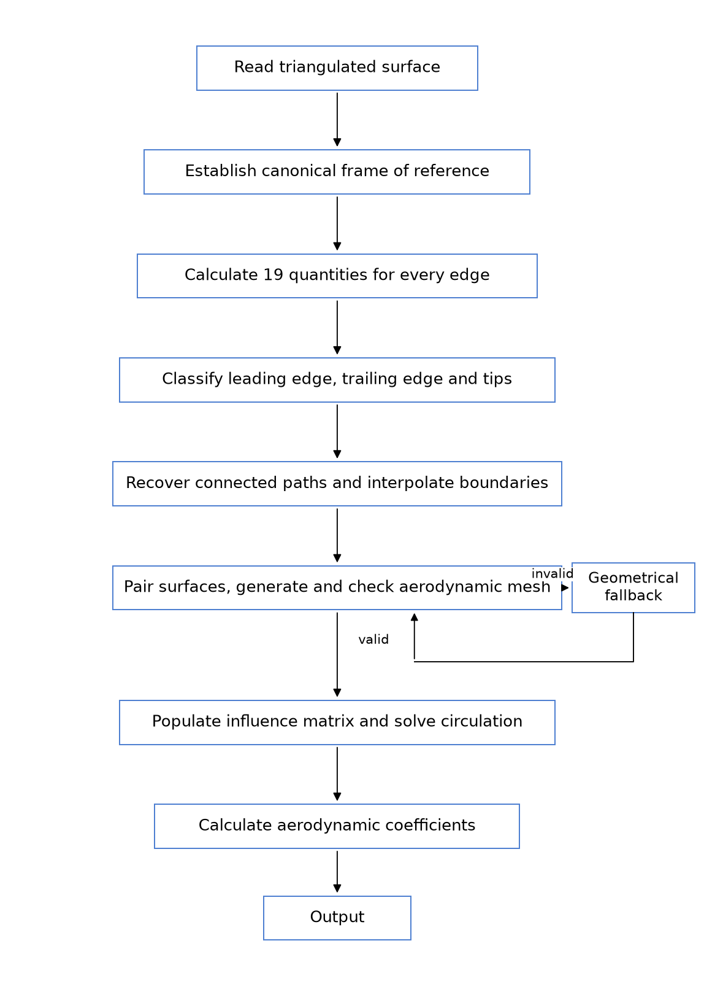
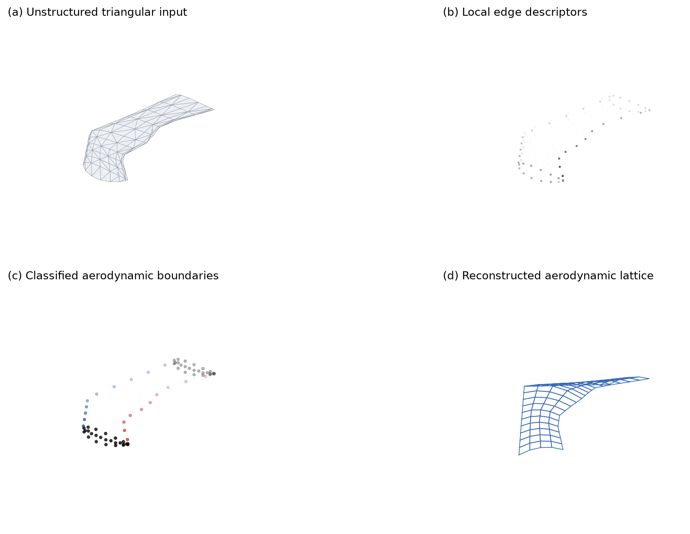
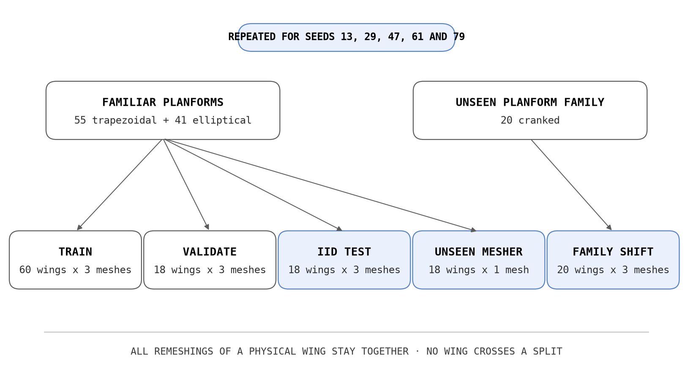
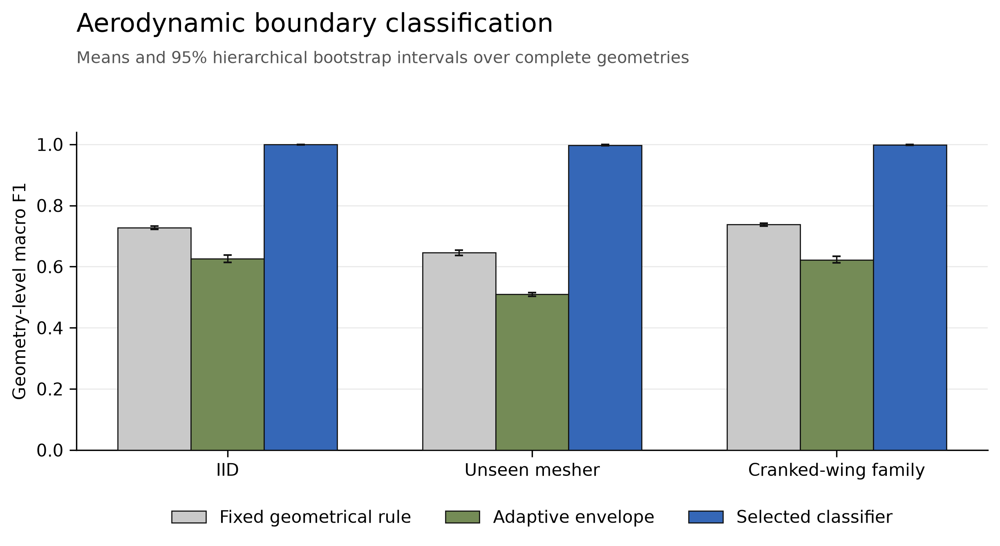
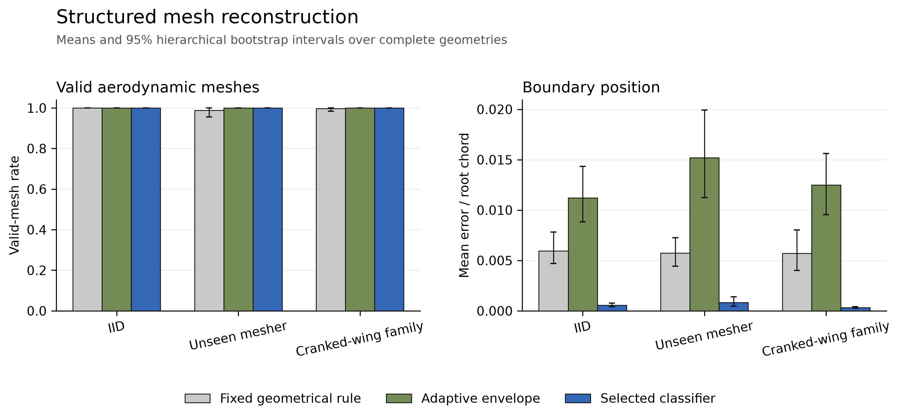
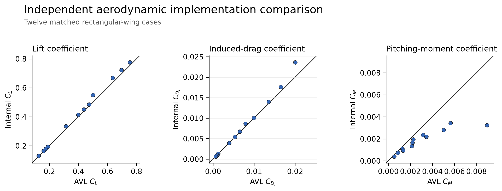
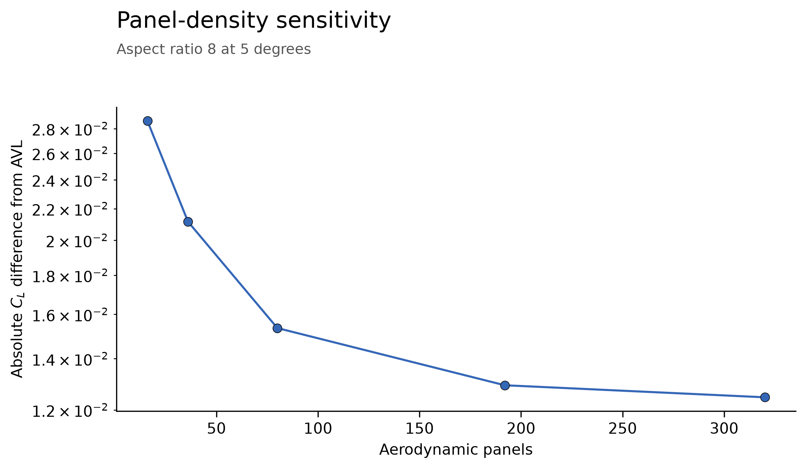
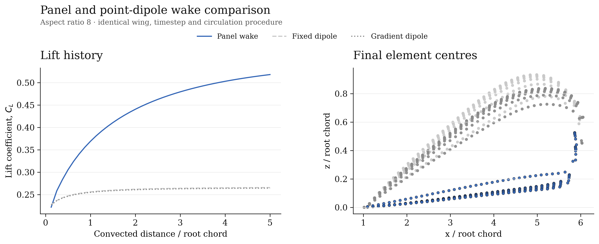

# Learning Aerodynamic Mesh Semantics from Triangulated Lifting Surfaces

## Abstract

This study presents a method for converting an unstructured triangulated lifting surface into a structured aerodynamic lattice from which aerodynamic coefficients can be calculated. The input geometry does not identify its leading edge, trailing edge, tips or camber surface. It is therefore repaired, placed in a consistent frame, and represented by 19 local geometrical and topological quantities for each edge. Classical classifiers assign one of four aerodynamic meanings to every edge. Connected boundary paths are then recovered, the upper and lower surfaces are paired, and a quadrilateral vortex lattice is constructed.

Models are selected using validation geometries and assessed using complete physical geometries. Four separate triangulations and three mesh densities are used so that recognition of the wing can be distinguished from recognition of one mesh pattern. The validation-selected classifiers achieved mean geometry-level macro F1 scores of 0.9994, 0.9976 and 0.9987 on the IID, unseen-mesher and cranked-wing-family tests. The fixed geometrical rule achieved 0.7280, 0.6454 and 0.7379 respectively.

On paired valid cases, mean absolute lift-coefficient error fell from 0.0473 to 0.0050 for IID geometry, from 0.1036 to 0.0086 for the unseen mesher, and from 0.0476 to 0.0073 for the cranked-wing family. Across 12 matched rectangular-wing cases, the internal vortex-lattice solver differed from AVL 3.32 by mean absolute values of 0.01771 in CL, 0.00053 in CDi and 0.00123 in CM.

Learned-only reconstruction produced a valid lattice for 1/5 ONERA M6 model seeds and 1/5 NASA CRM model seeds. The validity-gated hybrid produced a valid lattice in all 10/10 external runs by using the adaptive geometrical fallback when required. The method is therefore reliable over the generated geometry classes and independent triangulations considered here, but learned boundary recognition does not transfer reliably to either external geometry without a validity gate.

## 1. Introduction

Aerodynamic analysis at the early stages of aircraft design must be quick enough for many shapes to be considered. Computational Fluid Dynamics can represent the flow in much greater detail, but preparing the geometry and volume mesh can take a considerable amount of work. This is not always suitable while the aircraft is still changing. Lifting-line and vortex-lattice methods provide a faster alternative when the flow is attached and viscous and compressibility effects are not dominant [1,2].

The conventional vortex-lattice method used in this study still requires a suitable aerodynamic lattice. It cannot simply use an arbitrary surface triangulation. It requires organised spanwise and chordwise panels, a known trailing edge and a wake which leaves that edge. A fast aerodynamic calculation does not therefore guarantee a fast analysis. The preparation of the geometry can remain a substantial part of the complete process.

An STL surface is a set of triangular facets. It records the shape, but it does not normally state which edges form the leading edge, trailing edge or tips. It also does not provide the camber surface on which a lifting lattice should be placed. More importantly, one physical wing can be represented by many different triangulations. The triangles can change in number, size and direction while the underlying aircraft remains the same.

This makes the task a problem of geometry semantics. The useful information is not merely that an edge joins two vertices. The method must decide what the edge means aerodynamically, turn separate predictions into continuous boundaries, and construct a lattice which remains suitable for analysis.

A deterministic geometrical rule provides a useful starting point. It can select edges near the front, rear and span limits of the planform. Such a rule, however, is sensitive to the thresholds chosen. Sweep, taper, twist, thickness and triangulation can all change the measurements seen at an aerodynamic boundary. Several measurements may each be uncertain while their combination still identifies the boundary clearly.

Classical machine-learning methods provide one way of combining these measurements. They are used here only for boundary recognition. The aerodynamic mesh still has to be reconstructed by computational geometry and the aerodynamic coefficients are still obtained from a vortex-lattice calculation. This distinction is important. A high edge-classification score has little value if the predicted edges do not form a connected boundary or if the resulting lattice changes the calculated forces.

The research questions are consequently:

1. Can classical classification methods recognise the leading edge, trailing edge and tips more reliably than deterministic geometrical rules?
2. Can the recognised edges be converted into a valid structured aerodynamic lattice?
3. Does improved boundary recognition reduce the error in lift, induced drag and pitching moment caused by geometry reconstruction?
4. Does the method continue to work when the triangulation procedure or complete planform family has not been used for fitting?
5. Does the complete method transfer to independently prepared lifting-surface geometries?

The aerodynamic implementation is checked separately against finite-wing lifting-line trends and AVL 3.32 [3]. AVL supplies an independent implementation of a related low-order method. The internal and AVL cases use the same planform, section, twist, camber and reference quantities.

The principal contributions of the study are:

1. recognition of four aerodynamic edge meanings from 19 local geometrical and topological descriptors;
2. structured reconstruction of a camber-surface vortex lattice from connected predicted boundaries; and
3. measurement of how recognition and reconstruction errors pass into the resulting aerodynamic coefficients.

The complete process is assessed from the triangulated input to the final coefficients. Classification accuracy, boundary accuracy, reconstruction failure and aerodynamic error are reported separately so that a good result in one part cannot hide a failure in another.

## 2. Related Work

### 2.1 Low-order aerodynamic analysis

The vortex-lattice method is based on Prandtl's lifting-line theory. A lifting surface is replaced by a lattice of vortex filaments or rings. Their circulation strengths are found by requiring zero normal flow at selected collocation points. Forces are then calculated from the circulation using the Kutta--Joukowski theorem. Katz and Plotkin give a detailed account of the potential-flow and vortex-lattice methods used as the aerodynamic basis of this study [1].

The main advantage is that only the lifting surface and wake are represented. A volume mesh around the aircraft is not required. The price is a restricted physical model. The method assumes incompressible, inviscid and mainly attached flow, and it is most useful before separation and shock effects become important [2].

AVL represents aircraft using lifting surfaces and slender bodies, and calculates aerodynamic coefficients, trim conditions and stability derivatives [3]. Its geometry input is already organised into aerodynamic sections. The present problem occurs before that stage: the aerodynamic sections and boundaries must be inferred from an unlabelled triangulated surface.

### 2.2 Automatic geometry preparation

Automatic geometry and mesh preparation has been studied because it can take a large part of the complete analysis time. Aftosmis, Berger and Melton developed robust Cartesian mesh generation for component-based aircraft geometry [4]. Tomac and Eller connected aircraft descriptions to CFD grids using CEASIOM and SUMO [5]. Berard, Rizzi and Isikveren similarly connected parameterised aircraft descriptions to CAD, panel and CFD representations through CADac [6]. Takiguchi and colleagues automated geometry preparation, meshing, solver settings and post-processing for concept-stage vehicle aerodynamics [7].

These methods demonstrate that much of the analysis process can be automated when the input description already contains useful component or parameter information. The present input contains less information. It is an unstructured triangular surface, and the aerodynamic boundaries have to be recovered before a lifting-surface lattice can be made.

Delaunay triangulation provides a way of producing independent triangular meshes from points inside a bounded domain [8]. Gmsh provides general geometry and mesh-generation facilities [9]. Version 2.7.0 is used for the external Common Research Model triangulation [10]. Delaunay triangulations are also used in the generated benchmark so that the classifier is not assessed only on alternating diagonals from a regular grid.

### 2.3 Geometrical descriptors and mesh classification

Principal Component Analysis can describe whether a local group of points behaves mainly like a line, a plane or a volume [11]. Local surface normals, normal variation and eigenvalue relationships have also been used to retain ridges and corners while smoothing triangular meshes [12]. These measurements describe local shape, but an aerodynamic boundary also depends on its planform position and its connection to the rest of the wing.

Vidal, Wolf and Dupont extracted feature lines from triangular CAD meshes using geometrical descriptors, an RBF Support Vector Machine and a Potts regulariser [13]. Kalogerakis, Hertzmann and Singh combined learned labels and a structured graphical model for three-dimensional mesh segmentation [14]. Both studies show the benefit of combining local evidence with mesh neighbourhood information. Their labels and datasets differ from the four aerodynamic edge classes considered here, so their reported scores are not directly comparable.

The classifiers used in this study are logistic regression [15], distance-weighted nearest neighbours [16], RBF Support Vector Machines [17], Random Forests [18] and Extra Trees [19]. A Potts neighbourhood cost [20] is also considered as a structured comparator. The intention is not to assume that one classifier is generally best. Selection is carried out using complete validation geometries and the selected model is then tested without further adjustment.

### 2.4 Evaluation using complete geometries

Edges from one mesh are strongly related. A random edge split would place near-identical parts of the same physical wing into fitting and testing data. It would also allow different remeshings of the same continuous geometry to cross the split. Both would make the effective test easier than the intended application.

The independent unit in this study is therefore a physical wing geometry. Remeshings of that wing remain together. The experiment is repeated with five complete dataset and model seeds. Confidence intervals are obtained by a hierarchical bootstrap [21] which first resamples the seed and then the physical geometry. Remeshing results are averaged within each physical geometry before statistical comparison.

### 2.5 External geometries

The ONERA M6 wing is defined by the ONERA D section and the planform described by Schmitt and Charpin [22]. The NASA Common Research Model was developed as a public geometry for applied CFD validation studies [23]. The high-speed wing-body definition from the fourth AIAA Drag Prediction Workshop is used here [24], with only the supported lifting surface retained for the geometry-transfer experiment.

Neither geometry is used to fit or select a classifier. They provide a separate test of whether semantics learned from the generated wings transfer to a different source, scale, section distribution and triangulation. Their aerodynamic calculations remain matched low-order code-to-code comparisons; they are not comparisons with the transonic experiments for which the geometries are commonly used.

### 2.6 Position of this study

The studies above address separate parts of the process. Low-order methods calculate aerodynamic loads from an organised lifting surface. Mesh generators produce triangulations from known domains. Mesh-classification methods assign geometrical or part labels. The present study joins the required parts for a narrower lifting-surface problem.

The input is an unlabelled triangular surface. Local descriptors provide evidence about each mesh edge. A classifier supplies edge probabilities. Computational geometry recovers connected aerodynamic boundaries and a camber surface. A validity-checked quadrilateral lattice is then passed to a vortex-lattice solver. This makes it possible to judge the semantic method by the aerodynamic result it ultimately enables.

## 3. Method

### 3.1 Complete process

The complete method is shown in Figure 1. It is essentially a sequence of five problems. The surface is first cleaned and placed in a consistent coordinate system. Descriptors are calculated and the mesh edges are classified. Connected leading, trailing and tip paths are then recovered. The upper and lower surfaces are paired to obtain the camber surface, from which the structured lattice is constructed. Finally, the aerodynamic coefficients are calculated.

{width=70%}

*Figure 1: Structure of the complete geometry-to-coefficient method.*

A validity gate follows reconstruction. If any required boundary is missing, if the chord becomes negative, or if the panel topology is not usable, the method returns an explicit failure code. For the external tests only, the complete hybrid can then attempt the adaptive geometrical envelope. The fallback remains a prediction from geometry and is not treated as a reference annotation.

### 3.2 STL preparation

STL files can repeat the three vertices of every triangular facet. Their facets may also contain inconsistent orientation, duplicates or zero area. Before any descriptors are calculated, vertices are welded using a tolerance proportional to the diagonal of the geometry bounding box. Faces which collapse after welding, have negligible area or repeat another face are removed.

Face orientation is repaired one connected component at a time. Adjacent faces sharing an ordinary manifold edge are required to traverse that edge in opposite directions. Closed components are given outward orientation using their signed volume. The number of boundary and nonmanifold edges is then recorded, together with whether the surface is closed, consistently oriented or intentionally open.

A separate robustness suite changes scale, repeats vertices, reverses facets, removes facets, introduces nonuniform density and writes and reloads binary STL. These cases are not included in the principal accuracy benchmark.

### 3.3 Canonical coordinate system

Raw coordinates cannot be used directly because the same wing may be translated, rotated or scaled. The canonical frame is right handed:

- \(x\) points from the leading edge towards the trailing edge;
- \(y\) points from the left tip towards the right tip; and
- \(z\) points upwards through the lifting surface.

Area-weighted first and second moments of the triangular faces give the broad axes of the surface. Face-normal distributions identify the thin direction. Where reliable, upper-to-lower closure edges crossing the root plane resolve the remaining chord-direction ambiguity. The coordinates are translated to the centre of the aligned bounding box and divided by the chordwise extent. The determinant of the final frame is checked to ensure that it remains right handed.

This frame is deliberately estimated before semantic recognition. Once connected leading and trailing paths have been found, their root-chord direction is used to remove any remaining rotation inside the section plane.

### 3.4 Edge descriptors

Each unique mesh edge is represented by the 19 quantities in Table 1. Midpoint coordinates, edge directions and lengths are normalised in the canonical frame. The dihedral quantity is the angle between the normals of the two adjacent triangular faces, rather than the aircraft-level wing dihedral angle. Boundary status records whether an edge has only one adjacent face.

A provisional local planform envelope supplies chord and span fractions. These are measurements, not labels. Local Principal Component Analysis supplies surface variation, linearity and planarity. All quantities are calculated without using the source semantic class.

**Table 1: Geometrical and topological quantities calculated for each mesh edge.**

| Number | Quantity | Description |
| ---: | --- | --- |
| 1--3 | Normalised midpoint | Canonical \(x\), \(y\) and \(z\) location |
| 4--6 | Absolute edge direction | Canonical \(x\), \(y\) and \(z\) alignment |
| 7 | Relative edge length | Edge length divided by the mean mesh-edge length |
| 8 | Face-normal angle | Local change between adjacent faces |
| 9 | Open-boundary flag | One adjacent triangular face |
| 10 | Local chord fraction | Position between provisional local front and rear limits |
| 11 | Absolute span fraction | Distance from the centre towards either tip |
| 12 | Spanwise alignment | Absolute alignment with the canonical span axis |
| 13--15 | Absolute mean normal | Canonical components of the neighbouring mean normal |
| 16 | Normal variation | Difference between neighbouring face normals |
| 17 | PCA surface variation | Smallest local eigenvalue divided by their sum |
| 18 | PCA linearity | Relative dominance of the largest local eigenvalue |
| 19 | PCA planarity | Relative separation of the two largest local eigenvalues |

There are four exclusive labels: ordinary surface, leading edge, trailing edge and tip. At a corner, the leading or trailing path meets the tip path through adjacent vertices; one mesh edge is not assigned two labels.

### 3.5 Classifiers and deterministic baselines

The fixed geometrical rule labels candidate sharp or open edges near prescribed local chord and span limits. The adaptive geometrical envelope instead labels edges directly from the local front, rear and span envelopes. Both are primary deterministic baselines.

The learned methods use the same 19 descriptors. Logistic regression and the RBF SVM use standardised features. Nearest neighbours uses distance weighting. Random Forest and Extra Trees combine nonlinear decision trees. For fitting, each boundary class contributes at most 24 edges from each remeshing and ordinary surface edges are sampled at no more than twice the combined boundary count. Every edge is retained during validation and testing.

Candidate hyperparameters are compared using validation geometries only. Selection first maximises valid-lattice rate, then minimises lift-coefficient error among paired valid cases, and finally maximises geometry-level macro F1. The selected model is refitted to the combined training and validation geometries.

The logistic-regression candidates use \(C=0.5\) and \(2\). The nearest-neighbour candidates use 7 and 13 neighbours with distance weighting. The RBF-SVM candidates use \(C=6\) and \(12\), with the kernel scale calculated from the standardised fitting data. Random Forest and Extra Trees each use 300 trees, a minimum leaf size of 2, and either the square root or one half of the descriptors at each split. Class weighting is used for logistic regression, the SVM and both tree ensembles.

The structured comparator starts from either RBF-SVM or Extra-Trees probabilities. A Potts cost penalises disagreement between neighbouring mesh edges. Its unary model and pairwise weight are selected on the same validation geometries. It is evaluated separately so that the benefit of neighbourhood regularisation is not assumed.

### 3.6 Connected boundary recovery

Separate edge labels are not yet aerodynamic boundaries. A usable leading edge must form one continuous path across the span, and each tip must connect the leading and trailing paths.

Class probabilities are converted into graph costs on the mesh edges. Leading-edge candidates on the rear part of the provisional chord, trailing-edge candidates on the front part, and tip candidates near the centre span are strongly reduced. A shortest-path calculation then finds the connected leading and trailing paths between the span extremes. Two further paths connect their left and right endpoints using tip probability.

Disconnected predictions are therefore excluded automatically. The path confidence, path length and span coverage are retained as diagnostics. A missing path, low confidence, insufficient tip path or inadequate span coverage causes a named reconstruction failure rather than a general false result.

### 3.7 Boundary and camber reconstruction

The recovered path vertices still contain triangulation-scale irregularity. A robust polynomial, limited to fifth order, is first fitted against span position using iterative bisquare weights. Points outside a median-absolute-deviation envelope are removed. The retained observations are then collapsed by span position and joined by linear interpolation. The polynomial is used only when too few unique span positions remain. The predicted tips set the usable span limits.

At every surface vertex, the fitted leading and trailing curves provide a chord fraction

\[
\xi = \frac{x-x_{LE}(y)}{x_{TE}(y)-x_{LE}(y)} .
\tag{1}
\]

Vertices with similar span and chord fraction but opposing upper and lower surface normals are paired. The midpoint of each pair is a camber observation,

\[
\mathbf{x}_c = \frac{\mathbf{x}_u+\mathbf{x}_l}{2}.
\tag{2}
\]

The observations are interpolated over span and chord fraction. Linear interpolation is used inside their covered domain and nearest-neighbour interpolation fills any remaining edge points. This retains the measured twist, dihedral and camber instead of flattening the wing.

Uniformly spaced span and chord fractions are evaluated on the fitted boundaries and camber surface. The resulting rows and columns form the quadrilateral aerodynamic lattice. Figure 2 shows the input triangles, the local geometric points, the recovered boundaries and the final lattice for a held-out cranked wing.

{width=100%}

*Figure 2: Unstructured triangular input, local geometric feature points, reconstructed aerodynamic boundaries and the resulting structured aerodynamic lattice.*

### 3.8 Lattice validity and reference quantities

Each quadrilateral is divided into triangles \((p_0,p_1,p_3)\) and \((p_1,p_2,p_3)\) for its area check. Every panel must have positive area, consistent upward orientation and a convex ordering. No panel edge may belong to more than two panels, and the expected number of outer boundary edges must be present. Chord must remain positive and the reconstructed leading and trailing curves must cover at least three quarters of the recovered span.

The aerodynamic reference area is obtained from the projected leading- and trailing-edge boundaries,

\[
S_{ref}=\int_{-b/2}^{b/2}c(y)\,dy ,
\tag{3}
\]

where \(c(y)=x_{TE}(y)-x_{LE}(y)\). The reference span is the recovered tip-to-tip distance and the mean aerodynamic chord is

\[
\bar{c}=\frac{1}{S_{ref}}\int_{-b/2}^{b/2}c^2(y)\,dy .
\tag{4}
\]

The moment reference uses the area-weighted quarter-chord \(x\) location on the symmetry plane. These four quantities are explicit properties of the aerodynamic lattice and are used without alteration in both internal and AVL calculations.

### 3.9 Aerodynamic calculation

The wing lattice contains one horseshoe vortex for each quadrilateral panel. Its bound segment lies on the quarter-chord line and its collocation point lies at the three-quarter-chord position. Both trailing legs follow the freestream vector to a distance equal to the larger of 50 reference chords and 10 reference spans.

The body axes are those defined in Section 3.3. Positive angle of attack gives the freestream a positive body-\(z\) component. The unit freestream and wind-axis lift vectors are

\[
\hat{\mathbf{e}}_V =
\begin{bmatrix}
\cos\alpha & 0 & \sin\alpha
\end{bmatrix}^{T},
\qquad
\hat{\mathbf{e}}_L =
\begin{bmatrix}
-\sin\alpha & 0 & \cos\alpha
\end{bmatrix}^{T}.
\tag{5}
\]

Positive circulation follows the bound segment from lower to higher \(y\). With this convention it produces positive lift. Positive pitching moment is nose up about the positive span axis.

The velocity induced by a finite vortex segment is obtained from the Biot--Savart law. For unit circulation the normal influence of horseshoe \(j\) at collocation point \(i\) is \(A_{ij}\). The zero-normal-flow condition gives

\[
\sum_j A_{ij}\Gamma_j =
-\mathbf{V}_{\infty}\cdot\hat{\mathbf{n}}_i .
\tag{6}
\]

The circulation strengths are found by solving this linear system after adding a diagonal regularisation of \(10^{-8}\). A direct linear solve is used unless the matrix is singular, in which case a least-squares solution is returned with a failed convergence flag. No coefficient sign is changed after the solution according to angle of attack.

The force on bound segment \(\mathbf{l}_j\) is calculated from

\[
\Delta\mathbf{F}_j =
\rho\Gamma_j\left(\mathbf{V}_{\infty}\times\mathbf{l}_j\right).
\tag{7}
\]

Lift is the projection of the total force onto \(\hat{\mathbf{e}}_L\), not the body-axis \(F_z\). The pitching moment is calculated about the reference point and projected onto the span axis. The coefficients are

\[
C_L=\frac{\mathbf{F}\cdot\hat{\mathbf{e}}_L}{qS_{ref}},
\qquad
C_M=\frac{\mathbf{M}\cdot\hat{\mathbf{e}}_y}{qS_{ref}\bar{c}},
\tag{8}
\]

where \(q=\tfrac{1}{2}\rho V_\infty^2\). Induced drag is obtained from the discrete trailing-vortex sheet in the Trefftz plane, reported as a positive magnitude, and divided by \(qS_{ref}\).

The generated wing and AVL descriptions use the same section coordinates. Camber follows a parabolic mean line and twist acts about quarter chord with positive twist defined as wash-in. The same section definition, reference area, chord, span and point are supplied to both solvers.

## 4. Experimental setup

### 4.1 Generated geometry benchmark

Each dataset seed contains 55 trapezoidal, 41 elliptical and 20 cranked physical wings. Aspect ratio varies from 4 to 18, sweep from \(-4^\circ\) to \(28^\circ\), taper ratio from 0.28 to 0.95, dihedral from \(-3^\circ\) to \(9^\circ\), twist from \(-5^\circ\) to \(4^\circ\), camber ratio from 0 to 0.045 and thickness ratio from 0.08 to 0.18. The cranked wings also vary their kink position and kink chord.

Requested aspect ratio is used to determine span from the exact continuous planform area. The resulting aspect ratio is checked after surface generation. The maximum permitted difference between the requested and resulting values is 0.02.

Four triangulations are generated independently from every continuous geometry:

1. a structured grid with alternating diagonals;
2. a uniform Delaunay distribution;
3. a randomized Delaunay distribution; and
4. an anisotropic Delaunay distribution.

The Delaunay points are created in a normalised planform and mapped onto the same continuous upper and lower surfaces. Coarse, medium and fine density levels are distributed across physical geometries. The continuous leading, trailing and tip curves are retained before triangulation. A mesh edge receives its source label from its relationship to these curves, not from vertex number or triangle direction.

### 4.2 Data divisions

The complete experiment is repeated for seeds 13, 29, 47, 61 and 79. For each seed, 35 trapezoidal and 25 elliptical geometries are used for training; 10 trapezoidal and 8 elliptical geometries are used for validation; and a different 10 trapezoidal and 8 elliptical geometries form the IID test.

The three structured, uniform-Delaunay and randomized-Delaunay triangulations are used for fitting and for the principal IID test. The anisotropic Delaunay triangulation of each IID geometry forms the unseen-mesher test and is never used for fitting. Twenty complete cranked geometries, each with the three seen triangulations, form the leave-one-family-out test. All remeshings of one physical wing remain in one data division.

{width=94%}

*Figure 3: Division of complete physical geometries for each dataset and model seed.*

### 4.3 Evaluation measures

Classification is first calculated on every complete remeshing. Macro F1 is the unweighted mean of the F1 scores for ordinary surface, leading edge, trailing edge and tip, so that the numerous ordinary edges cannot dominate the result. Leading-, trailing- and tip-edge F1 are also reported separately.

Reconstruction failure is reported separately from boundary error. For valid lattices, the root chord is recovered directly from the fitted leading and trailing boundaries. Symmetric curve distance for each aerodynamic boundary is then divided by that root chord.

Coefficient error compares a reconstructed lattice with the reference lattice generated directly from the same continuous physical surface and flow condition. Errors in \(C_L\), \(C_{D_i}\) and \(C_M\) are calculated only where both methods in the paired comparison produce valid lattices. No numerical penalty is assigned to an invalid lattice.

For each seed and physical geometry, remeshing measurements are averaged before inferential statistics are calculated. The hierarchical percentile bootstrap resamples the five dataset/model seeds first and the physical geometries inside each selected seed second. Ten thousand samples give 95% intervals. The standardised paired effect is the mean geometry-level paired improvement divided by the sample standard deviation of those improvements.

### 4.4 Aerodynamic checks

The internal solver is compared with finite-wing lifting-line theory and AVL 3.32. The principal code-to-code check contains rectangular wings of aspect ratio 4, 8, 12 and 20 at angles of attack \(2^\circ\), \(5^\circ\) and \(8^\circ\), giving 12 matched cases. Further sweeps cover negative and positive angle of attack, positive and negative twist, camber, panel density and trailing-leg length.

All matched cases use identical continuous planform and section definitions. Both solvers receive the same reference area, mean aerodynamic chord, span and moment reference point. \(C_L\), \(C_{D_i}\) and \(C_M\) are retained only if their mean absolute differences over the 12 principal cases pass the declared validation limits.

### 4.5 External geometry transfer

The ONERA M6 lifting surface is generated from the published section and planform definition. Symmetry-plane faces are removed before the half wing is mirrored and welded, which prevents coincident internal faces. The resulting surface is closed and consistently oriented.

For the Common Research Model, the supported wing entities are extracted from the official DPW4 wing-body geometry and triangulated using Gmsh 2.7.0. The isolated lifting surface is intentionally open at the root. ONERA M6 reference annotations follow the leading, trailing and tip curves retained during construction. The CRM reference annotations are constructed once on the isolated surface: root and tip extrema are connected by minimum-cost mesh paths biased towards the local front, rear and tip envelopes. The resulting reference annotations are then stored as immutable labelled artifacts.

All five selected model seeds are applied to both geometries. Three paths are kept distinct:

1. learned-only reconstruction;
2. deterministic reconstruction using the adaptive envelope; and
3. a validity-gated hybrid which uses the learned result when valid and otherwise uses the adaptive envelope.

The reference annotations are used only to measure recognition and to form a separate reference-boundary lattice. They are not supplied to the learned or deterministic reconstruction.

## 5. Results

### 5.1 Validation selection

Validation selected an RBF SVM for seeds 13, 47 and 79, a Random Forest for seed 29, and logistic regression for seed 61.

The fact that one model was not selected for every seed is useful. It shows why selection has to remain inside each fitting experiment. The result reported as the selected classifier is the result of that fixed validation procedure, not the best test-set classifier chosen afterwards.

### 5.2 Aerodynamic-boundary recognition

Table 2 gives the geometry-level edge-classification results. The selected classifiers are consistently better than both deterministic baselines on the IID, unseen-mesher and cranked-wing-family tests. The separate class scores show that this is not caused only by the large ordinary-surface class.

**Table 2: Aerodynamic edge recognition over complete test geometries.**

| Test | Method | Macro F1 | Leading F1 | Trailing F1 | Tip F1 |
| --- | --- | ---: | ---: | ---: | ---: |
| IID | Fixed geometrical rule | 0.7280 | 0.4009 | 0.8779 | 0.6911 |
| IID | Adaptive envelope | 0.6255 | 0.3186 | 0.3316 | 0.9795 |
| IID | Selected classifier | 0.9994 | 0.9991 | 0.9986 | 0.9997 |
| Unseen mesher | Fixed geometrical rule | 0.6454 | 0.2604 | 0.7422 | 0.6718 |
| Unseen mesher | Adaptive envelope | 0.5093 | 0.1669 | 0.1619 | 0.9633 |
| Unseen mesher | Selected classifier | 0.9976 | 0.9964 | 0.9953 | 0.9992 |
| Cranked-wing family | Fixed geometrical rule | 0.7379 | 0.4077 | 0.9012 | 0.6987 |
| Cranked-wing family | Adaptive envelope | 0.6225 | 0.3114 | 0.3293 | 0.9779 |
| Cranked-wing family | Selected classifier | 0.9987 | 0.9979 | 0.9978 | 0.9995 |

{width=88%}

*Figure 4: Geometry-level macro F1 for the deterministic baselines and selected classifier.*

The unseen-mesher result is particularly important. The anisotropic Delaunay procedure is absent from fitting, yet the selected method continues to identify all three aerodynamic boundary types. The cranked-family result also shows that the method is not restricted to interpolation between the two planform families used for fitting.

### 5.3 Structured lattice reconstruction

A correct edge label is useful only if it contributes to a complete lattice. Table 3 therefore reports reconstruction failure and the three boundary errors separately. The selected classifier gives a valid lattice for every principal test remeshing. Its leading and tip errors are much smaller than either deterministic baseline, while the trailing edge is also improved.

**Table 3: Validity and boundary error of reconstructed aerodynamic lattices.**

| Test | Method | Failure rate | Leading error / root chord | Trailing error / root chord | Tip error / root chord |
| --- | --- | ---: | ---: | ---: | ---: |
| IID | Fixed geometrical rule | 0.0000 | 0.01342 | 0.00236 | 0.00203 |
| IID | Adaptive envelope | 0.0000 | 0.01183 | 0.01368 | 0.00816 |
| IID | Selected classifier | 0.0000 | 0.00003 | 0.00135 | 0.00034 |
| Unseen mesher | Fixed geometrical rule | 0.0111 | 0.01146 | 0.00264 | 0.00307 |
| Unseen mesher | Adaptive envelope | 0.0000 | 0.01585 | 0.01613 | 0.01362 |
| Unseen mesher | Selected classifier | 0.0000 | 0.00007 | 0.00149 | 0.00059 |
| Cranked-wing family | Fixed geometrical rule | 0.0033 | 0.01135 | 0.00274 | 0.00307 |
| Cranked-wing family | Adaptive envelope | 0.0000 | 0.01015 | 0.01451 | 0.01278 |
| Cranked-wing family | Selected classifier | 0.0000 | 0.00002 | 0.00075 | 0.00020 |

{width=88%}

*Figure 5: Lattice validity and root-chord-normalised boundary error for the three principal tests.*

The fixed geometrical rule fails when its tip predictions do not form a sufficient connected path. This appears in the unseen-mesher and family-shift tests. The adaptive envelope remains valid, but its front and rear envelope labels are less accurate. The result demonstrates why semantic recognition and geometrical validity should be measured separately.

### 5.4 Effect on aerodynamic coefficients

Table 4 follows every valid reconstructed lattice through the aerodynamic solver. The selected method reduces the error in all three retained coefficients. The comparison is paired: a row is used only when both the fixed rule and the selected classifier produce a valid lattice for the same seed, physical geometry and remeshing.

**Table 4: Aerodynamic error caused by reconstructed geometry on paired valid cases.**

| Test | Coefficient | Fixed-rule error | Selected error | Mean reduction | 95% interval | Paired rows |
| --- | --- | ---: | ---: | ---: | ---: | ---: |
| IID | CL | 0.04733 | 0.00500 | 0.04233 | 0.03021 to 0.05536 | 270 |
| IID | CDI | 0.00166 | 0.00024 | 0.00141 | 0.00107 to 0.00178 | 270 |
| IID | CM | 0.01668 | 0.01019 | 0.00649 | 0.00377 to 0.01005 | 270 |
| Unseen mesher | CL | 0.10360 | 0.00863 | 0.09497 | 0.07177 to 0.11897 | 89 |
| Unseen mesher | CDI | 0.00345 | 0.00040 | 0.00305 | 0.00218 to 0.00400 | 89 |
| Unseen mesher | CM | 0.01559 | 0.01190 | 0.00369 | 0.00161 to 0.00614 | 89 |
| Cranked-wing family | CL | 0.04755 | 0.00727 | 0.04028 | 0.02555 to 0.05886 | 299 |
| Cranked-wing family | CDI | 0.00152 | 0.00029 | 0.00123 | 0.00086 to 0.00166 | 299 |
| Cranked-wing family | CM | 0.01744 | 0.00956 | 0.00788 | 0.00400 to 0.01361 | 299 |

Table 5 gives the principal paired effects after remeshings have been collapsed within each seed and physical geometry. All intervals for macro F1 and lift-coefficient error reduction remain above zero. The remeshing-pair count describes the available paired calculations, while the seed-geometry count describes the units entering the hierarchical analysis.

**Table 5: Hierarchical paired comparison with the fixed geometrical rule.**

| Test | Outcome | Mean improvement | 95% interval | Standardised paired effect | Remeshing pairs | Seed-geometry pairs |
| --- | --- | ---: | ---: | ---: | ---: | ---: |
| IID | Macro F1 | 0.27140 | 0.26608 to 0.27702 | 13.910 | 270 | 90 |
| IID | CL error reduction | 0.04233 | 0.03021 to 0.05536 | 0.896 | 270 | 90 |
| Unseen mesher | Macro F1 | 0.35219 | 0.34338 to 0.36132 | 9.522 | 90 | 90 |
| Unseen mesher | CL error reduction | 0.09497 | 0.07177 to 0.11897 | 0.901 | 89 | 89 |
| Cranked-wing family | Macro F1 | 0.26085 | 0.25625 to 0.26555 | 12.217 | 300 | 100 |
| Cranked-wing family | CL error reduction | 0.04028 | 0.02555 to 0.05886 | 0.682 | 299 | 100 |

The very large standardised effects for macro F1 arise because the classification improvement is both large and consistent over the generated geometries. They should not be read as evidence of comparable transfer to arbitrary aircraft surfaces; that question is addressed separately by the external tests.

### 5.5 Descriptor, data and triangulation sensitivity

Table 6 removes or isolates groups of descriptors while retaining the selected classifier family and selection parameters for each seed. Global position and planform position alone are insufficient. Local geometry without the planform descriptors is nearly sufficient, and combining all 19 gives the most consistent unseen-mesher result.

**Table 6: Feature-group ablation for the selected classifier.**

| Descriptor group | IID macro F1 | Unseen-mesher macro F1 | Cranked-family macro F1 |
| --- | ---: | ---: | ---: |
| Global position | 0.4280 | 0.4104 | 0.4402 |
| Planform position | 0.4697 | 0.4308 | 0.4691 |
| Geometry without planform position | 0.9993 | 0.9968 | 0.9993 |
| Planform, topology and local shape | 0.9966 | 0.9967 | 0.9961 |
| All 19 descriptors | 0.9994 | 0.9976 | 0.9987 |

The learning curve in Table 7 begins with complete physical geometries rather than an arbitrary number of edges. Performance is already high with the smallest fitting set and becomes more stable as complete geometries are added.

**Table 7: Learning curve measured by complete fitting geometries.**

| Fitting geometries | IID macro F1 | Unseen-mesher macro F1 | Cranked-family macro F1 |
| ---: | ---: | ---: | ---: |
| 12 | 0.9951 | 0.9884 | 0.9948 |
| 24 | 0.9977 | 0.9941 | 0.9978 |
| 48 | 0.9985 | 0.9942 | 0.9968 |
| 78 | 0.9993 | 0.9971 | 0.9980 |

Table 8 separates mesh density and triangulation procedure. Classification changes little with density, while aerodynamic error falls as the input mesh becomes finer. The anisotropic Delaunay triangulation is the most difficult of the four and also gives the largest lift-coefficient error, but it remains well below the fixed-rule result in Table 4.

**Table 8: Mesh-density and triangulation sensitivity.**

| Sensitivity | Level | Selected macro F1 | Selected CL error |
| --- | --- | ---: | ---: |
| Mesh density | Coarse | 0.9993 | 0.00854 |
| Mesh density | Medium | 0.9994 | 0.00373 |
| Mesh density | Fine | 0.9994 | 0.00275 |
| Triangulation | structured alternating | 1.0000 | 0.00481 |
| Triangulation | delaunay uniform | 1.0000 | 0.00497 |
| Triangulation | delaunay random | 0.9981 | 0.00524 |
| Triangulation | delaunay anisotropic | 0.9976 | 0.00901 |

### 5.6 Structured comparator

The Potts comparator was included to test whether an explicit neighbourhood penalty improves the already connected local predictions. Table 9 shows no consistent improvement. Every confidence interval for the change in macro F1 and lift error crosses zero, and validity is unchanged.

**Table 9: Effect of validation-selected Potts regularisation.**

| Test | Metric | Selected classifier | Selected structured Potts | Mean improvement from structure | 95% interval |
| --- | --- | ---: | ---: | ---: | ---: |
| IID | Macro F1 | 0.99935 | 0.99916 | -0.00019 | -0.00145 to 0.00054 |
| IID | Failure rate | 0.00000 | 0.00000 | 0.00000 | 0.00000 to 0.00000 |
| IID | CL error | 0.00500 | 0.00502 | -0.00002 | -0.00008 to 0.00002 |
| Unseen mesher | Macro F1 | 0.99764 | 0.99805 | 0.00041 | -0.00115 to 0.00246 |
| Unseen mesher | Failure rate | 0.00000 | 0.00000 | 0.00000 | 0.00000 to 0.00000 |
| Unseen mesher | CL error | 0.00901 | 0.00908 | -0.00007 | -0.00020 to 0.00009 |
| Cranked-wing family | Macro F1 | 0.99874 | 0.99868 | -0.00006 | -0.00202 to 0.00140 |
| Cranked-wing family | Failure rate | 0.00000 | 0.00000 | 0.00000 | 0.00000 to 0.00000 |
| Cranked-wing family | CL error | 0.00727 | 0.00727 | 0.00000 | -0.00001 to 0.00001 |

The connected-path reconstruction already applies a strong structural constraint after classification. This helps to explain why smoothing local edge labels a second time does not materially change the final lattice.

### 5.7 Aerodynamic implementation

Table 10 gives the independent implementation comparison for the 12 rectangular-wing cases. All three coefficients pass their validation limits. The lift-slope sweep also follows the finite-wing trend: increasing aspect ratio moves the calculated slope towards the two-dimensional value, while the sign of lift changes continuously through zero angle of attack.

**Table 10: Independent low-order comparison with AVL 3.32.**

| Coefficient | Cases | Mean absolute difference from AVL | Maximum absolute difference from AVL |
| --- | ---: | ---: | ---: |
| CL | 12 | 0.01771 | 0.05082 |
| CDI | 12 | 0.00053 | 0.00359 |
| CM | 12 | 0.00123 | 0.00571 |

{width=91%}

*Figure 6: Internal and AVL lift, induced-drag and pitching-moment coefficients for the 12 matched rectangular-wing cases.*

The panel-density sweep approaches a stable result as the lattice is refined. Changes in trailing-leg length are also checked because the finite horseshoe legs must approximate a semi-infinite wake without becoming part of the intended geometry difference.

{width=82%}

*Figure 7: Absolute lift-coefficient difference from AVL as the rectangular-wing lattice is refined.*

### 5.8 STL robustness

All 8 STL robustness cases remained free of nonmanifold edges after repair and matched their expected open or closed topology.

This test is deliberately separate from the semantic accuracy results. It shows that routine storage faults can be cleaned without changing the statistical population used to support the boundary-recognition claim. It does not show that arbitrary damaged aircraft files can always be repaired.

### 5.9 External geometry transfer

The external result is substantially weaker than the generated benchmark. Table 11 shows that learned-only reconstruction is usually rejected by the lattice validity checks on both geometries. The gated hybrid remains operational because it can use the adaptive geometrical envelope, but the fallback does not recover the reference annotations and should not be interpreted as an accurate semantic annotation.

\Needspace{12\baselineskip}

**Table 11: Geometry transfer to independently prepared lifting surfaces.**

| Geometry | Path | Seeds | Mean macro F1 | Valid lattices | Fallback uses |
| --- | --- | ---: | ---: | ---: | ---: |
| ONERA M6 | Learned only | 5 | 0.4816 | 1/5 | 0 |
| ONERA M6 | Validity-gated hybrid | 5 | 0.3729 | 5/5 | 4 |
| NASA CRM DPW4 | Learned only | 5 | 0.3395 | 1/5 | 0 |
| NASA CRM DPW4 | Validity-gated hybrid | 5 | 0.4610 | 5/5 | 4 |

Table 12 compares internal and AVL calculations made from the deterministic fallback lattice and from the reference-boundary lattice. These are matched low-order comparisons only. The close ONERA agreement and larger CRM differences describe implementation agreement for these particular lattices; neither is a validation against experimental transonic aerodynamics.

**Table 12: Matched low-order code-to-code differences on external geometries.**

| Geometry | Reconstruction | CL difference | CDi difference | CM difference |
| --- | --- | ---: | ---: | ---: |
| ONERA M6 | Adaptive fallback | 0.00047 | 0.00011 | 0.00502 |
| ONERA M6 | Reference-boundary lattice | 0.00439 | 0.00022 | 0.00163 |
| NASA CRM DPW4 | Adaptive fallback | 0.05144 | 0.00180 | 0.02595 |
| NASA CRM DPW4 | Reference-boundary lattice | 0.05146 | 0.00264 | 0.02823 |

The result provides a clear boundary on the learned claim. Independent triangulation of a familiar generated geometry is handled well. Transfer to a differently sourced wing with a different section and mesh distribution is not. A validity gate prevents the failure from being hidden, but broader training geometry or a stronger geometry-invariant representation is required before learned-only reconstruction can be relied upon for these external inputs.

## 6. Discussion

### 6.1 What the classifier has learnt

The generated experiments show that the aerodynamic boundaries are not defined reliably by one fixed threshold. The fixed rule recognises much of the trailing edge, but it is weaker at the leading edge and tips. The adaptive envelope finds the span limits well, but an envelope alone does not distinguish the front and rear boundary accurately on every triangulation.

The selected classifiers combine local surface shape, topology, direction and planform position. The ablation result shows that the near-perfect score is not simply a consequence of using absolute coordinates. Global position alone performs poorly, as does planform position alone. The local geometric descriptors carry most of the useful information, while the full set gives the most consistent transfer to the unseen triangulation.

The generated task is nevertheless controlled. All wings are made from the same continuous section construction and vary inside declared parameter ranges. Independent triangulations prevent a classifier from succeeding only by memorising alternating diagonals, and the cranked-family test changes the planform relation, but neither test changes the complete geometry source. The external result demonstrates the difference. A model can generalise across triangulations of the generated surfaces and still fail when the section distribution, closure, scale and sampling come from another geometry process.

### 6.2 Why reconstruction must be evaluated

Edge-level classification does not enforce a complete leading edge, trailing edge or pair of tips. The graph stage is therefore not merely cosmetic post-processing. It changes local probabilities into connected paths which can define a span and chord.

The validity checks are equally important. Without them, a method could return a panel grid despite a missing tip, reversed chord or inconsistent neighbour relation. Such a grid might still produce a numerical coefficient, but that number would not represent the intended surface. Explicit failure codes keep this condition separate from aerodynamic error.

The selected method succeeds on every principal generated test case, while the fixed rule has isolated missing-tip failures. Coefficient comparisons exclude those unpaired failures and report the failure rate separately. This avoids improving an average by assigning an arbitrary large error to a failed mesh, and it also avoids making failures disappear by calculating error only on successful cases.

### 6.3 Downstream aerodynamic effect

The geometric improvement remains visible after the lattice is passed to the solver. The selected method reduces \(C_L\), \(C_{D_i}\) and \(C_M\) error for IID geometry, an unseen triangulation procedure and the excluded cranked family. The confidence intervals in Table 5 show that the lift-error reduction is consistent when seed and physical geometry are treated as the sampling hierarchy.

The effect on \(C_M\) is smaller and the remaining error is larger relative to the other coefficients. This is reasonable because pitching moment depends on both the force and its location relative to the reference point. Small errors in the camber surface or chord distribution can therefore affect moment without producing the same change in total lift.

The internal solver comparison places a separate limit on interpretation. Geometry-to-coefficient error is measured using one internal low-order solver for both source and reconstructed lattices, so it isolates the effect of geometry preparation. Agreement with AVL shows that the implementation gives similar low-order results for the matched rectangular cases. It does not establish viscous, separated or compressible-flow accuracy.

### 6.4 Structured regularisation

Potts regularisation does not improve the principal result. The local classifier is already highly accurate over the generated benchmark and the following shortest-path stage already enforces connected boundaries. There is consequently little inconsistent local evidence left for the Potts term to correct.

This negative result is still useful. It shows that adding a structured classifier is not automatically beneficial when a later geometry algorithm already imposes the required global structure. The simpler selected classifier followed by connected-path reconstruction is sufficient for the present benchmark.

### 6.5 Role of the deterministic fallback

The adaptive fallback makes the external pipeline operational, but it does not make learned transfer successful. Its semantic F1 can be below that of the invalid learned result because validity and semantic accuracy answer different questions. The fallback uses broad planform envelopes which are likely to form connected boundaries even when those boundaries do not closely follow the reference annotations.

The correct interpretation is therefore narrow. The gate detects that a learned lattice is unusable and substitutes a deterministic lattice which passes structural checks. This is preferable to returning an invalid result, but it is not evidence that the fallback has found the correct aerodynamic semantics. External use would require both stronger transfer data and a separate accuracy requirement after fallback.

## 7. Limitations

The study considers isolated lifting surfaces. It does not identify complete aircraft components, construct body meshes, resolve intersections between components or generate junction panels. Multiple lifting surfaces, control-surface gaps and disconnected components are outside the implemented method.

The principal benchmark is generated from trapezoidal, elliptical and cranked planforms with one continuous section construction. It varies important geometric quantities and triangulation procedures, but it does not contain the full diversity of CAD practices or aircraft topology. The near-perfect generated classification result must be read together with the poor learned-only external transfer.

Source curves are known for the generated data because they are retained before triangulation. The ONERA M6 annotations also follow retained construction curves. The Common Research Model annotations are algorithmic paths on the isolated CAD-derived mesh rather than author-supplied semantic labels. They provide one fixed comparison reference, but they are not independent manual ground truth. Real STL files may not have an agreed semantic reference, particularly near blunt trailing edges, clipped tips or merged components.

The repair stage handles the declared scale, duplication, orientation, missing-facet and density changes. It does not guarantee recovery from severe holes, self-intersections or nonmanifold component assemblies. A topology check can reject such a file, but rejection is not the same as repair.

The aerodynamic calculation is a low-order inviscid model. It cannot represent profile drag, boundary layers, separated flow or transonic shocks. The external geometries are therefore used for geometry transfer and matched low-order implementation comparisons only.

Five complete seeds provide repeated dataset generation and model selection, but they do not exhaust every possible split or parameter distribution. The hierarchical intervals describe uncertainty over these generated experiments. They are not population intervals for all aircraft geometries.

The wake experiment in Appendix A is limited to a prescribed free-wake comparison on simple rectangular wings. It does not support a general statement about vortex-particle wake methods. It only tests the particular replacement of each newborn vortex ring by one equivalent point dipole under matched numerical conditions.

## 8. Conclusion

This study has shown a complete route from an unstructured triangulated lifting surface to low-order aerodynamic coefficients. Nineteen edge descriptors are used to recognise ordinary surface, leading-edge, trailing-edge and tip edges. Mesh adjacency then turns the local predictions into connected boundaries, paired upper and lower observations define the camber surface, and validity checks prevent an unsuitable lattice from reaching the aerodynamic calculation.

On the generated benchmark, the selected classical classifiers are substantially more accurate than the two deterministic rules. The improvement remains when the triangulation procedure is excluded from fitting and when the complete cranked-wing family is withheld. It also reduces the downstream errors in lift, induced drag and pitching moment.

The external geometries provide the important qualification. Learned-only reconstruction usually fails their validity checks. A deterministic fallback restores a usable lattice, but does not establish accurate semantic transfer. The method is therefore successful for the declared generated lifting-surface classes and independent triangulations, while broader geometry transfer remains unresolved.

The main result is not classification alone. It is the connection between recognised aerodynamic meaning, a valid structured lattice and the final coefficient error. Treating these as separate measured stages makes clear where the method succeeds and where further work is required.

## Appendix A. Point-dipole wake experiment

Unsteady vortex-lattice methods shed and convect wake elements at every timestep. Vortex particles provide one way of avoiding a continually connected panel wake [25], and point-vortex or particle methods require careful treatment of their positions and moments [26]. The question tested here is narrower: can one newly shed quadrilateral vortex ring be replaced directly by one point dipole while retaining the same wake motion?

Both wake representations begin with the same newborn vortex ring at the same quarter-timestep location. For the dipole case, the point is placed at the ring centroid and its moment is the circulation multiplied by the ring area vector. The panel and dipole calculations use the same freestream, timestep, convection level and core radius. One dipole treatment keeps the moment fixed; the other rotates it using the local velocity gradient while preserving its magnitude.

Panel-wake spatial and temporal convergence is checked before the representations are compared. A separate unit-ring experiment confirms that the induced velocity of the equivalent dipole approaches that of the ring as observation distance increases. This far-field agreement is necessary, but it does not imply that the replacement is accurate in the near wake where neighbouring elements interact strongly.

Table 13 gives the matched comparison. Both dipole treatments diverge materially from the panel-wake trajectory and lift history. Updating the moment from the local gradient reduces trajectory error, but does not make the two wake representations equivalent.

**Table 13: Panel-wake and point-dipole differences under matched numerical conditions.**

| Aspect ratio | Point-dipole update | Trajectory RMS / root chord | Mean absolute CL difference |
| ---: | --- | ---: | ---: |
| 4 | Fixed moment | 0.4292 | 0.1318 |
| 4 | Local-gradient moment | 0.4112 | 0.1323 |
| 8 | Fixed moment | 0.5196 | 0.1786 |
| 8 | Local-gradient moment | 0.4795 | 0.1796 |
| 12 | Fixed moment | 0.6710 | 0.1867 |
| 12 | Local-gradient moment | 0.5738 | 0.1885 |

{width=90%}

*Figure 8: Lift history and final wake-element positions for the matched panel and point-dipole calculations at aspect ratio 8.*

The point-dipole approximation is accurate in the far field of an isolated ring, but replacing near-wake rings removes information which remains important to their mutual convection. Similar-looking scalar behaviour would not be enough to validate the wake state. For the direct one-ring-to-one-dipole replacement tested here, the connected panel wake should be retained.

## References

1. J. Katz and A. Plotkin, *Low-Speed Aerodynamics*, 2nd ed., Cambridge University Press, 2001.
2. J. J. Bertin and M. L. Smith, *Aerodynamics for Engineers*, 4th ed., Prentice Hall, 1998.
3. M. Drela and H. Youngren, *Athena Vortex Lattice*, version 3.32, 16 December 2012. <https://web.mit.edu/drela/Public/web/avl/avl3.32.tgz>
4. M. J. Aftosmis, M. J. Berger and J. E. Melton, “Robust and efficient Cartesian mesh generation for component-based geometry,” *AIAA Journal*, 36(6), 952–960, 1998. DOI: 10.2514/2.464.
5. M. Tomac and D. Eller, “From geometry to CFD grids—an automated approach for conceptual design,” *Progress in Aerospace Sciences*, 47(8), 589–596, 2011. DOI: 10.1016/j.paerosci.2011.08.005.
6. A. Berard, A. Rizzi and A. T. Isikveren, “CADac: a new geometry construction tool for aerospace vehicle pre-design and conceptual design,” 26th AIAA Applied Aerodynamics Conference, AIAA-2008-6219, 2008. DOI: 10.2514/6.2008-6219.
7. T. Takiguchi, K. Ogawa, H. Tateyama and T. Oda, “The automatic aerodynamic CFD framework employing vehicle specifications at the concept stage of development,” SAE Technical Paper 2013-01-0604, 8 April 2013. DOI: 10.4271/2013-01-0604.
8. B. N. Delaunay, “Sur la sphère vide,” *Bulletin de l'Académie des Sciences de l'URSS, Classe des Sciences Mathématiques et Naturelles*, 6, 793–800, 1934.
9. C. Geuzaine and J.-F. Remacle, “Gmsh: a 3-D finite element mesh generator with built-in pre- and post-processing facilities,” *International Journal for Numerical Methods in Engineering*, 79(11), 1309–1331, 2009. DOI: 10.1002/nme.2579.
10. C. Geuzaine and J.-F. Remacle, *Gmsh*, version 2.7.0, 8 March 2013. <https://gmsh.info/bin/Linux/gmsh-2.7.0-Linux64.tgz>
11. I. T. Jolliffe, *Principal Component Analysis*, 2nd ed., Springer, 2002. DOI: 10.1007/b98835.
12. X. Jiao and P. J. Alexander, “Parallel feature-preserving mesh smoothing,” in *Computational Science and Its Applications—ICCSA 2005*, 1180–1189, 2005. DOI: 10.1007/11424925_123.
13. V. Vidal, C. Wolf and F. Dupont, “Robust feature line extraction on CAD triangular meshes,” *Proceedings of the International Conference on Computer Graphics Theory and Applications*, 106–112, 2011. DOI: 10.5220/0003361701060112.
14. E. Kalogerakis, A. Hertzmann and K. Singh, “Learning 3D mesh segmentation and labeling,” *ACM Transactions on Graphics*, 29(3), 1–12, 2010. DOI: 10.1145/1833349.1778839.
15. D. R. Cox, “The regression analysis of binary sequences,” *Journal of the Royal Statistical Society: Series B*, 20(2), 215–232, 1958. DOI: 10.1111/j.2517-6161.1958.tb00292.x.
16. T. Cover and P. Hart, “Nearest neighbor pattern classification,” *IEEE Transactions on Information Theory*, 13(1), 21–27, 1967. DOI: 10.1109/TIT.1967.1053964.
17. C. Cortes and V. Vapnik, “Support-vector networks,” *Machine Learning*, 20(3), 273–297, 1995. DOI: 10.1007/BF00994018.
18. L. Breiman, “Random forests,” *Machine Learning*, 45(1), 5–32, 2001. DOI: 10.1023/A:1010933404324.
19. P. Geurts, D. Ernst and L. Wehenkel, “Extremely randomized trees,” *Machine Learning*, 63(1), 3–42, 2006. DOI: 10.1007/s10994-006-6226-1.
20. J. Besag, “On the statistical analysis of dirty pictures,” *Journal of the Royal Statistical Society: Series B*, 48(3), 259–279, 1986. DOI: 10.1111/j.2517-6161.1986.tb01412.x.
21. B. Efron, “Bootstrap methods: another look at the jackknife,” *The Annals of Statistics*, 7(1), 1–26, 1979. DOI: 10.1214/aos/1176344552.
22. V. Schmitt and F. Charpin, *Pressure Distributions on the ONERA-M6 Wing at Transonic Mach Numbers*, AGARD-AR-138, May 1979.
23. J. C. Vassberg, M. A. DeHaan, S. M. Rivers and R. A. Wahls, “Development of a Common Research Model for applied CFD validation studies,” 26th AIAA Applied Aerodynamics Conference, AIAA-2008-6919, 2008. DOI: 10.2514/6.2008-6919.
24. AIAA CFD Drag Prediction Workshop, *DPW4 Wing-Body Geometry Without Tail, Version 03*, 7 November 2008. <https://web.archive.org/web/20090320225007id_/http://aaac.larc.nasa.gov/tsab/cfdlarc/aiaa-dpw/Workshop4/Geometry/2008-11-07/DPW4_wb_no_tail_v03.igs.gz>
25. D. J. Willis, J. Peraire and J. K. White, “A combined pFFT-multipole tree code, unsteady panel method with vortex particle wakes,” *International Journal for Numerical Methods in Fluids*, 53(8), 1399–1422, 2007. DOI: 10.1002/fld.1240.
26. G. S. Winckelmans and A. Leonard, “Contributions to vortex particle methods for the computation of three-dimensional incompressible unsteady flows,” *Journal of Computational Physics*, 109(2), 247–273, 1993. DOI: 10.1006/jcph.1993.1216.
